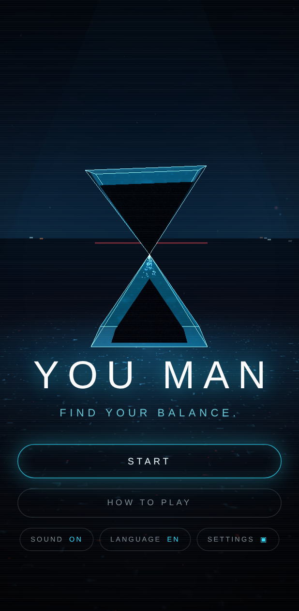
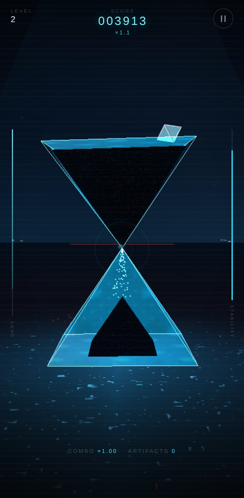
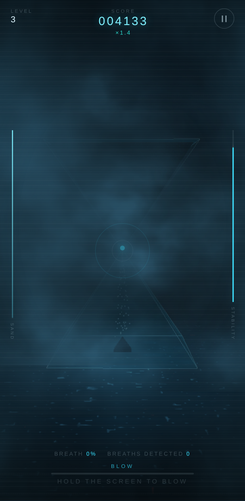

# YOU MAN

**Find your balance.**

A 3D mobile mini-game. An hourglass made of two inverted crystal pyramids stands
tip to tip. You keep the upper pyramid balanced on that single point — by
physically tilting your phone — until all the sand has drained through.

Three levels, each adding one sense:

| # | Name | Input | What changes |
|---|------|-------|--------------|
| 1 | Balance | gyroscope | Pure equilibrium. Learn the inertia. |
| 2 | Interference | gyroscope + touch | Artifacts fall toward the glass; tap them away, on the beat, without losing the axis. |
| 3 | Breath | gyroscope + microphone | The scene starts blind. Blow to clear the mist — while still holding steady. |

<p align="center">
  
  
  
</p>

---

## Gameplay loop

```
intro → how to play → motion permission → calibration → 3·2·1·BALANCE
      → hold the axis while the sand drains
      → level complete → next sense → finale (score, precision, rank)
      ↘ lose the axis → game over → retry
```

Scoring rewards *stillness*, not survival. Points scale with how close to dead
centre you hold the object, and the multiplier only grows while you are inside
the perfect radius. Level 2 adds an artifact combo chain; level 3 adds breath
ticks.

---

## Running it

No build step, no bundler, no install. Three.js is vendored in `vendor/`, and
every sound is synthesised at runtime — there is nothing to download.

```bash
npm start                # http://localhost:5173
```

Any static server works (`python3 -m http.server`, `npx serve`, …). The one
requirement is that files are served over HTTP(S) — opening `index.html` from
`file://` breaks ES modules and the service worker.

### On a phone (gyroscope + microphone)

Both sensors require a **secure context**. `localhost` counts; your LAN IP does
not. The dev server can issue a self-signed certificate for exactly this:

```bash
npm run dev:https        # prints https://<your-lan-ip>:5173
```

Open that URL on the phone, accept the certificate warning once, and play. If
you would rather not deal with certificates, a tunnel works equally well:

```bash
npx localtunnel --port 5173      # or: ngrok http 5173
```

**Testing the gyroscope.** Tap `START` → `CALIBRATE GYROSCOPE`. On iOS 13+ a
system dialog appears — it is requested synchronously inside your tap, which is
the only way iOS grants it. On Android no dialog appears; instead the game
listens for 1.4 s to confirm real `deviceorientation` events actually arrive
(some browsers expose the API but never fire it). Hold the phone the way you
intend to play and tap calibrate: that orientation becomes the neutral point,
and the meter only fills while the device is reasonably still.

**Testing the microphone.** It is requested once, at the start of level 3, and
never before. Blow steadily across (not into) the mic; the meter at the bottom
of the screen shows the detected strength. Mist clears in patches, so aim by
turning slightly. Audio is analysed on the device and nothing is recorded — see
[Privacy](#privacy).

### On desktop

Everything is playable without any sensor:

| Control | Action |
|---|---|
| Mouse position over the canvas | Tilt (screen centre = neutral) |
| Arrow keys / `WASD` | Tilt |
| Click | Destroy an artifact (level 2) |
| Hold `B` | Simulate a breath (level 3) |
| `Esc` / `P` | Pause |

The game detects a non-touch device and shows the desktop hints automatically.
The touch fallback is also what a phone without a usable gyroscope gets: the
`USE TOUCH MODE` button on the permission screen switches to dragging anywhere
on the screen, with no change to the visuals.

### Install as a PWA

`manifest.webmanifest` + `sw.js` cache the whole app shell. On Android, Chrome
offers "Add to home screen"; on iOS use Share → Add to Home Screen. It launches
fullscreen, portrait, and runs offline.

---

## Project structure

```
index.html                  every screen, declared as [data-screen] sections
manifest.webmanifest, sw.js PWA shell + offline cache
styles/main.css             the entire interface
vendor/three.module.min.js  Three.js r180, vendored (no CDN, works offline)

src/
  main.js                   boot, screen flow, the single rAF loop
  core/
    config.js               ← every tuning value in the game lives here
    state.js                screen machine + run statistics
    events.js               tiny pub/sub so systems never import each other
    storage.js              localStorage with an in-memory fallback
    i18n.js                 EN / FR dictionaries + [data-i18n] binding
    utils.js                math, formatting, haptics, sensor smoothing
  input/
    permissions.js          every OS prompt, in one place
    tilt.js                 gyroscope ⟷ pointer/keyboard, calibration
    mic.js                  breath detection (RMS + spectral flatness)
  audio/
    audio.js                AudioContext, mix buses, limiter, shared reverb
    music.js                lookahead BPM sequencer, quantisation grid
    sfx.js                  all procedural sound effects
  render/
    renderer.js             WebGL, camera framings, adaptive quality
    environment.js          sky, wet floor, neon horizon, light shaft, dust
    hourglass.js            the two pyramids, glass shader, sand, topple
    particles.js            pooled pixel-burst system
    mist.js                 level 3 volumetric mist + camera veil
  game/
    balance.js              the inverted-pendulum model
    score.js                points, multiplier, combo
    artifacts.js            level 2 falling objects, screen-space picking
    levels/                 baseLevel.js + level1/2/3.js
  ui/
    screens.js, hud.js, settings.js

tools/
  serve.mjs                 static server, optional HTTPS
  smoke-test.mjs            headless play-through of all three levels
  gen-icons.mjs             renders the PWA PNG icons (no dependencies)
```

---

## How the systems work

### Balance

`src/game/balance.js` is an inverted pendulum with a deliberately forgiving
middle. Near the centre the object behaves like a damped spring following your
tilt — readable and calm. As the lean grows, a destabilising term fades in and
the spring loses authority, so drifting outward accelerates. That produces a
wide safe zone and a genuinely tense edge without the knife-edge instability of
a true pendulum.

Sensor input passes through a deadzone, then an exponential smoother, then an
acceleration clamp, so nothing ever snaps. Crossing the warning angle starts a
grace countdown rather than ending the run instantly; only the hard failure
angle is immediate. The edges shift cyan → red, the tension drone rises, the
device vibrates, and the reticle dot drifts off centre — four independent
channels telling you the same thing.

### Sand

Volume is preserved rather than faked. A pyramid anchored at its apex and
scaled by `f` has volume `f³`, so the upper fill is `cbrt(remaining)` and the
lower heap is `cbrt(1 - remaining)`. The flow rate drops slightly when the neck
is off-axis, which makes the drain itself a readout of your steadiness. Grains
falling through the contact point keep the horizontal momentum the tilted apex
gave them.

### Audio

Everything is generated with the Web Audio API — there are no audio files, so
nothing can 404 and the game is silent-free offline. `music.js` runs a
lookahead scheduler on a 16th-note grid; gameplay never plays a percussive
sound on a frame boundary, it asks `nextQuantised(division)` for the upcoming
subdivision and schedules there. Each artifact type carries its own rhythmic
division (red on 8ths, orange on 32nds, white on downbeats), so destroying
things composes rather than clatters. Music intensity rises with the level and
the filter opens as your stability drops.

> **PLACEHOLDER_SFX** — the synth voices in `sfx.js` stand in for a final sound
> design pass. To swap in recorded assets, replace the function bodies; no call
> site takes any other dependency.

### Breath detection

A breath is broadband noise close to the mic; speech and music are peaky, a tap
is a single transient. So `mic.js` requires *both* sustained energy above the
calibrated room floor *and* high spectral flatness (geometric ÷ arithmetic mean
of the spectrum), then smooths the result. Ambient level is measured for 1.6 s
at the start of the level. The smoke test verifies this end-to-end by feeding
Chromium a white-noise WAV as a fake capture device.

### Mist

A shell of billboarded noise puffs, each with its own density and resistance,
so breath clears the scene in patches rather than as a uniform fade. Puffs
alone leave gaps, so a veil pinned just in front of the camera closes them —
at full density the scene really is unreadable, and every bit of visibility has
to be earned. Sand barely moves while you are blind, which makes clearing the
mist the actual progress bar.

### Performance

Quality is auto-detected from `deviceMemory` / `hardwareConcurrency` / screen
size and can be overridden in settings. A frame-rate monitor drops a tier after
2.5 s sustained below 42 fps. Tiers control device-pixel-ratio cap, particle
and mist budgets, and glass detail. There is no post-processing pass: bloom is
faked with additive shells, which is dramatically cheaper on mobile GPUs.

---

## Tuning

`src/core/config.js` holds every gameplay value — level durations, instability,
warning and failure angles, grace period, spawn rates, scoring weights, BPM,
microphone thresholds, particle budgets, haptic patterns. Level length is
`CONFIG.levels[n].sandDuration` in seconds.

In the browser console, `window.YOUMAN` exposes `{ game, state, CONFIG, gfx,
audio, music, tilt, mic }` for live tweaking.

---

## Privacy

- No sensor is opened without an explicit tap. Nothing is requested on page load.
- The microphone stream is connected to an `AnalyserNode` and nothing else: no
  `MediaRecorder`, no buffers retained, no network. Only two scalars leave the
  module — an intensity and a boolean. `release()` stops every track when
  level 3 ends or you return to the menu.
- Only settings and the best score are persisted, in `localStorage`.
- The game makes no network requests at all after loading.

---

## Testing

```bash
npm start &      # the smoke test needs a server on :5173
npm run smoke
```

The smoke test drives the real UI in a phone-sized headless Chromium: boots,
walks the menu, takes the touch fallback (headless has no gyroscope),
calibrates, plays all three levels — including destroying an artifact by
projected tap and clearing the mist — reaches the finale, and asserts the best
score persisted. Any console error fails the run. A second pass opens a real
`getUserMedia` stream fed with synthetic white noise and asserts the breath
detector fires and releases cleanly.

```bash
npm run icons    # regenerate the PWA PNGs after editing assets/icons/icon.svg
```

---

## Known browser limitations

- **iOS requires HTTPS and a tap** for `DeviceMotion`. The request is issued
  synchronously inside the gesture handler; awaiting anything first (including
  unlocking audio) silently loses the permission. Audio is unlocked afterwards.
- **Android has no motion permission dialog**, so availability is verified by
  probing for real events for 1.4 s before trusting the sensor. If the sensor
  disappears mid-game the game falls back to touch without interrupting play.
- **Audio cannot start before a user gesture** in any browser. Everything before
  the first tap is silent by design.
- **Vibration** is unsupported on iOS Safari; the haptics slider has no effect
  there.
- **`navigator.share`** is not universal; the share button falls back to
  copying the score to the clipboard.
- **Changing graphics quality** re-creates the dust field, but particle and mist
  pool sizes are fixed at construction — reload for those to take full effect.
- **Landscape** is supported and reflows, but the game is composed for portrait.

---

## Licence

Three.js is MIT (see the header in `vendor/three.module.min.js`). Everything
else here is original.
